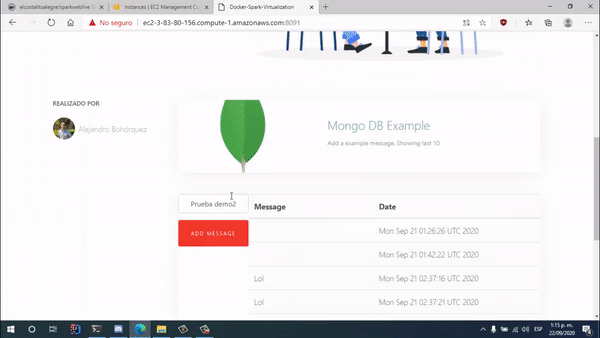

# LAB 5 AREP DOCKER + SPARK + AWS + LOAD BALANCING :rocket:

In this repository you will find a solution to LAB 5 Workshop. we learned about virtualization with docker and deploy to AWS, Availability with Load Balancer client and Rest Server. The virtualization is the future, you know :laughing:

You will find 4 principal packages in this repository.

- Client source: https://github.com/AlejandroBohal/LAB5-AREP-DOCKER/tree/master/Client
- Server source: https://github.com/AlejandroBohal/LAB5-AREP-DOCKER/tree/master/SparkWebLive
- Local compose source: https://github.com/AlejandroBohal/LAB5-AREP-DOCKER/tree/master/DockerCompose
- AWS compose source:https://github.com/AlejandroBohal/LAB5-AREP-DOCKER/tree/master/DockerCompose-AWS


This project has continuous integration, both for the client and for the server with Circle ci.
### Cliente
[](https://circleci.com/gh/AlejandroBohal/LoadBalancerClient)
### Servidor
[](https://circleci.com/gh/AlejandroBohal/ServerRestSpark)


## Architecture 

This project is composed of several components located in different layers, the main components are 

  - Web client with load balancer that divides the requests made to the server.
  - Web server that handles the requests received from the client, 3 replicas of this component are created to maintain redundancy and increase both availability and system performance.
  - MongoDB persistence image that provides information to the respective
 
These components were contained in the docker-composite which is responsible for creating an image for each of them. We have the docker-layer which is composed of the components described above, the AWS-EC2 layer which is in charge of keeping these containers in the cloud and the security layer which is managed for now with the AWS security groups.


# User guide

## User guide for local instance

1. Clone this repository and build the cliente and the server with maven.

Execute the following commands on your computer's terminal.

```
git clone https://github.com/AlejandroBohal/LAB5-AREP-DOCKER
cd Client
mvn clean install
mvn package
cd ..
cd SparkWeblibe
mvn clean install
mvn package
```
2. Use the docker-compose to instantiate the images and the respective containers for each image. Once these steps have been completed, you will have 4 main containers
    - 3 Server Instances subtract
    - 1 instance of the web client with the load balancer
    - Mongodian Database Instance

Execute the following commands in your computer's terminal from the root directory of this project.
```
cd DockerCompose
docker-compose up -d --scale web=3
```
Once this is done, you can see the containers and images created with the following commands
```
Docker ps -a // list the containers
Docker images  // lists the images currently in the machine. 
```
You will see the following in console:


Or if your computer is Mac/Windows you can see the results directly from the Docker desktop


To see the project running you can go to 
http://localhost:8091 from your browser.


## User guide for cloud instance

To have an instance in the cloud you must meet the following pre-requisites:
    - Virtual machine in the cloud from AWS, Azure, etc (linux recommended)
    - Have docker and docker compose installed on your machine
    
Una vez dentro de la máquina seguir estos pasos:

1. Clone the images from docker hub client an server.

```
docker pull elcostalitoalegre/sparkweblive:loadbalancer
docker pull elcostalitoalegre/sparkweblive:web
```

2. Clone this repository (We only need the DockerComposeAWS Package)

```
git clone https://github.com/AlejandroBohal/LAB5-AREP-DOCKER
cd DockerCompose-AWS
```

3. Generate the images and containers from the dockercompose

```
docker-compose up -d --scale web=3
```

And finally we gonna have the same as the local user guide:
    - 3 Server Instances subtract
    - 1 instance of the web client with the load balancer
    - Mongodb Database container
    
in the web live demo you can see the project working.

## Live Demo



In the following gif we can appreciate a small demo of the web client that is in charge of balancing the load in the different server nodes, this client is deployed in aws in the docker containers.

You can see the complete demonstration of the operation in the following link

https://youtu.be/iAMj8_ZNwjg


## Author 

- Sergio Alejandro Bohorquez Alzate.
